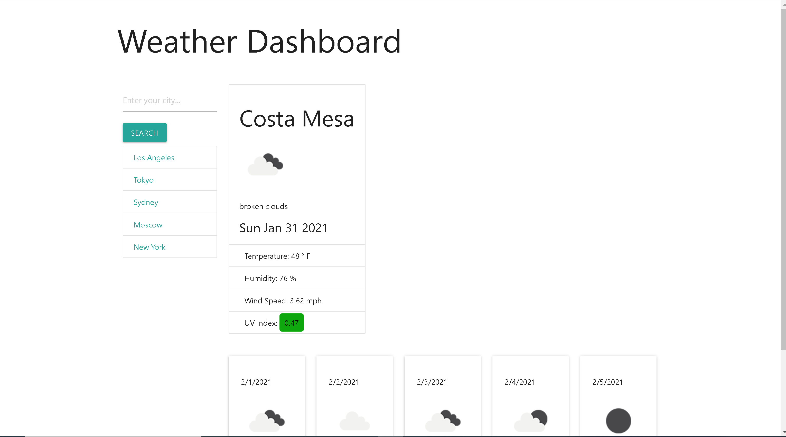
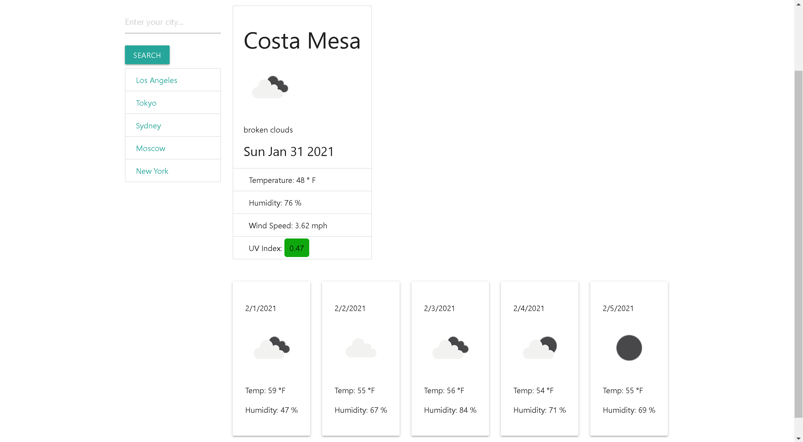

# Weather Dashboard
A web app that displays up to date weather statistics and predictions.  The user is able to type a city name into the search box and when their input is submitted, the users input is used as a search term for the Open Weather API.  Data for that corresponding city is then fetched and pupolated onto the page in an easily readable graphic dashboard.  

There are two main sections on this webpage, the search section and the results section.   The search section contains the searh bar, search button, and a list of 5 popular cities.  When the popular cities are clicked, the name of the clicked city is entered as a search term.  In the results section there are two rows.  the is a current forecast card that shows the forecast information for that moment.  Below that is a five day forecast.  

Local storage saves the last search and loads that search upon reloading the webpage.  If there is no last search value then the default city on display is Los Angeles.  In the future it would be good to build a feature that gets the users current location and loads that upon opening, but for now LA works for the MVP default.

Here is a link to my deployed application on GitHub pages:
https://nystphens.github.io/weather-dashboard/

Here is a screenshot of the deployed application:

